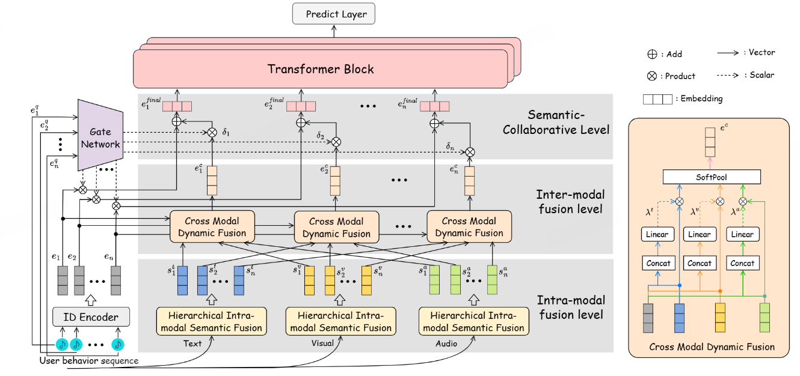

# HarmonRec

**HarmonRec: Hierarchical Semantic Codebook Learning with Multimodal-Collaborative Alignment for Music Recommendation**

> *Submitted to IEEE Transactions on Multimedia (TMM).*
> An end-to-end sequential-retrieval framework that combines per-item adaptive
> hierarchical semantic-ID reweighting (HISF), cross-modal semantic–collaborative
> joint modeling (CMDF), and a frequency-aware long-tail rebalancing strategy.

<p align="center">
  
</p>

> 📌 **Where to place the framework figure**
> Put your `framework.png` (or `.pdf` / `.jpg`) at:
>
> ```
> HarmonRec/assets/framework.png
> ```
>
> The Markdown above references `assets/framework.png` directly; once the file
> exists in that path it will render on GitHub. We recommend a `1600×900 PNG`
> (best for GitHub rendering) and an additional vector `PDF` if needed for
> camera-ready use.

---

## 1. Highlights

- **Item-level adaptive Semantic-ID fusion (HISF).**
  Each item dynamically reweights its hierarchical RQ codebook layers conditioned
  on its collaborative ID embedding, alleviating the well-known
  *semantic-ID collision* problem of generative-retrieval recommenders.

- **Cross-modal semantic–collaborative joint modeling (CMDF).**
  Per-modality content embeddings (text / audio / visual) are jointly attended
  to the collaborative signal at the item level, so that the most informative
  modality is selected on a per-track basis.

- **Frequency-aware rebalancing.**
  A learnable `[w_id, w_con]` gate driven by the (log-normalized) item frequency
  shifts the representation budget away from popular items toward long-tail
  items, yielding disproportionately large gains in the cold-start regime.

- **End-to-end and lightweight.**
  HarmonRec is trained end-to-end with a standard BCE objective on top of a
  Transformer sequence encoder; no auxiliary pre-training stage is required.

---

## 2. Repository Structure

```
HarmonRec/
├── assets/                       # Figures used in the README (place framework.png here)
├── python/                       # PyTorch implementation
│   ├── main.py                   # Training / evaluation entry point
│   ├── model.py                  # HarmonRec model: HISF + CMDF + frequency rebalancing
│   ├── utils.py                  # Data sampler, full-sort evaluation, long-tail evaluation
│   └── data/                     # Put dataset & per-modality semantic-ID files here
│       └── README.md             # Description of the required data files
├── .gitignore
└── README.md
```

---

## 3. Requirements

> *The repository is implemented in PyTorch and tested on a single NVIDIA GPU.
> The exact versions used by the authors will be released together with the
> camera-ready paper.*

| Component | Version |
|---|---|
| Python | `>=3.10` |
| PyTorch | *(to be filled)* |
| CUDA | *(to be filled)* |
| numpy | *(to be filled)* |
| tqdm | *(to be filled)* |

Install (placeholder):

```bash
# Create a fresh environment
conda create -n harmonrec python=3.10 -y
conda activate harmonrec

# Install PyTorch (please match your CUDA version)
pip install torch torchvision torchaudio
pip install numpy tqdm
```

---

## 4. Data Preparation

HarmonRec consumes four files per dataset (paths are relative to `python/`):

| File | Format | Description |
|---|---|---|
| `data/<dataset>.txt`         | `user_id  item_id` per line, ordered chronologically per user | User–item interaction sequence. |
| `data/text_semantic_id.txt`  | `item_id \t c1,c2,c3` per line | 3-layer text-modality semantic IDs (produced by RQ / clustering). |
| `data/audio_semantic_id.txt` | `item_id \t c1,c2,c3` per line | 3-layer audio-modality semantic IDs. |
| `data/visual_semantic_id.txt`| `item_id \t c1,c2,c3` per line | 3-layer visual-modality semantic IDs. |

For datasets with fewer modalities (e.g. text only) simply omit the
corresponding files; the model will skip the missing modality automatically.

See [`python/data/README.md`](python/data/README.md) for the exact directory
layout and the example file naming used in the paper.

**Datasets used in the paper.**

| Dataset | #Users | #Items | #Interactions | Modalities |
|---|---:|---:|---:|---|
| Music4all-onion | 116,831 | 55,008 | 38,204,151 | text / audio / visual |
| 30Music         | 43,911  | 839,749 | 13,219,802 | text |
| Pixel1M         | 1,001,822 | 97,505 | 19,879,192 | text / audio / visual |

*Pre-processed splits and semantic-ID files will be released upon paper acceptance.*

---

## 5. Quick Start

### 5.1 Train on Music4all-onion (default)

```bash
cd python

python main.py \
    --dataset music4all_onion \
    --train_dir run1 \
    --text_semantic_id_path data/text_semantic_id.txt \
    --audio_semantic_id_path data/audio_semantic_id.txt \
    --visual_semantic_id_path data/visual_semantic_id.txt \
    --batch_size 128 \
    --lr 0.001 \
    --maxlen 500 \
    --hidden_units 128 \
    --mm_dim 128 \
    --num_blocks 2 \
    --num_heads 1 \
    --dropout_rate 0.2 \
    --num_epochs 1000 \
    --codebook_width 512 \
    --num_hierarchies 3 \
    --temp 0.7 \
    --device cuda
```

The training process

1. Trains HarmonRec with early stopping (patience = 10, evaluated every 4 epochs
   on the validation set with 200 sampled negatives).
2. Loads the best checkpoint and runs **full-sort** test evaluation.
3. Runs the **cold-start / long-tail evaluation** (head / mid / tail buckets)
   and writes per-bucket results to `<dataset>_<train_dir>/log.txt`.

All artefacts (checkpoints, args dump, log) are written to:

```
python/<dataset>_<train_dir>/
├── args.txt
├── log.txt
└── HarmonRec.epoch=*.lr=*.layer=*.head=*.hidden=*.maxlen=*.pth
```

### 5.2 Inference only (with a saved checkpoint)

```bash
cd python

python main.py \
    --dataset music4all_onion \
    --train_dir run1 \
    --state_dict_path music4all_onion_run1/HarmonRec.epoch=<E>.lr=0.001.layer=2.head=1.hidden=128.maxlen=500.pth \
    --inference_only true \
    --text_semantic_id_path data/text_semantic_id.txt \
    --audio_semantic_id_path data/audio_semantic_id.txt \
    --visual_semantic_id_path data/visual_semantic_id.txt
```

---

## 6. Evaluation Protocol

For both the overall and the long-tail experiments we follow the **full-sort**
protocol: for each test user, the ground-truth target item is ranked against
the entire item corpus excluding only items already interacted in training and
validation (no random negative sampling). This is widely regarded as the most
reliable evaluation paradigm in sequential recommendation, since random-negative
protocols are sensitive to the choice of negative sample size and tend to
over-estimate ranking quality.

The cold-start / long-tail evaluation (Section IV-D of the paper) further
bucketizes items by training-interaction count:

- **Head**: top 20 % most-popular items
- **Mid**: next 30 %
- **Tail**: bottom 50 % (long-tail / cold-start items)

A user is assigned to a bucket according to the popularity bucket of his/her
ground-truth test item, and `Recall@{5,10}` and `NDCG@{5,10}` are reported
per bucket.

---

## 7. Key Hyper-parameters

| Argument | Meaning | Default |
|---|---|---:|
| `--mm_dim` | Unified multimodal target dimension. | `128` |
| `--hidden_units` | Transformer hidden dimension (kept = `mm_dim`). | `128` |
| `--num_blocks` | Number of Transformer blocks. | `2` |
| `--num_heads` | Attention heads. | `1` |
| `--maxlen` | Maximum sequence length per user. | `500` |
| `--dropout_rate` | Dropout on embeddings and FFN. | `0.2` |
| `--num_hierarchies` | Number of RQ codebook layers. | `3` |
| `--codebook_width` | Codebook width (per layer). | `512` |
| `--temp` | Softmax temperature τ for frequency-aware reweighting. | `0.7` |
| `--lr` | Adam learning rate. | `1e-3` |
| `--batch_size` | Mini-batch size. | `128` |
| `--num_epochs` | Maximum number of training epochs (early-stop patience = 10). | `1000` |

---

## 8. Reproducing the Paper

| Result table | Where to look |
|---|---|
| Overall comparison (Table II) | `python/<dataset>_<train_dir>/log.txt` line `best_test (...)` |
| Ablation study (Table III) | Re-run with `--override_*` arguments to disable individual modules |
| **Cold-start / long-tail (Table IV)** | `python/<dataset>_<train_dir>/log.txt` lines `longtail_head / longtail_mid / longtail_tail` |

> The exact hyper-parameter sweeps (including the per-dataset codebook width
> and the optimal `temp`) used in the paper are listed in Section IV-A of the
> manuscript and will also be released as ready-to-run shell scripts.

---

## 9. Citation

If you find HarmonRec useful in your research, please consider citing:

```bibtex
@article{harmonrec2025,
  title={{HarmonRec}: Hierarchical Semantic Codebook Learning with
         Multimodal-Collaborative Alignment for Music Recommendation},
  author={(to be filled)},
  journal={IEEE Transactions on Multimedia},
  year={2025},
  note={Under review}
}
```

---

## 10. Acknowledgements

We thank the authors of Music4all-onion, 30Music and Pixel1M for releasing the
datasets used in our evaluation.

---

## 11. License

This repository is released for academic research under the *(to be filled)*
license. Please refer to the LICENSE file (to be added) for the exact terms.

---

## 12. Contact

For questions, bug reports or collaboration enquiries, please open an issue
in this repository or contact the authors at *(to be filled)*.
